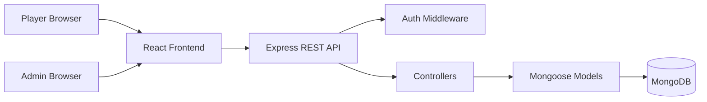

# MERN Quiz Game

COMP5347/COMP4347 Assignment 2 scaffold.

## Current Status

This repository is a project framework prepared by the group leader. It fixes the architecture, file ownership boundaries, routes, models, state-management locations, and documentation templates. Feature implementation is intentionally left as TODO work for team members.

## Approved Variation

TODO: Choose exactly one and get tutor acknowledgement by the end of Week 9.

- Timed questions
- Categorised quizzes
- Image-based questions
- Review mode after completion

Chosen variation: `TODO`

Justification and design decisions: `TODO`

## Tech Stack

- MongoDB + Mongoose
- Express + Node.js
- React + React Router
- React Context + useReducer for quiz state
- React Hook Form + Zod for all forms
- JWT authentication

## Setup

### Backend

```bash
cd backend
cp .env.example .env
npm install
npm run dev
```

Required environment variables:

| Variable | Purpose |
| --- | --- |
| `PORT` | Backend port, default `5001` |
| `MONGODB_URI` | MongoDB connection string |
| `JWT_SECRET` | Secret used to sign JWTs |
| `JWT_EXPIRES_IN` | JWT expiry, e.g. `7d` |
| `CLIENT_ORIGIN` | Frontend URL for CORS |

### Frontend

```bash
cd frontend
npm install
npm run dev
```

Optional frontend environment variable:

```bash
VITE_API_URL=http://localhost:5001/api
```

## Architecture



## Backend Structure

```text
backend/
  server.js
  config/db.js
  models/
    User.js
    Question.js
    Score.js
  controllers/
    auth.controller.js
    quiz.controller.js
    admin.controller.js
  routes/
    auth.routes.js
    quiz.routes.js
    admin.routes.js
  middleware/
    auth.middleware.js
    admin.middleware.js
    rateLimit.middleware.js
    error.middleware.js
  utils/envelope.js
```

## Frontend Structure

```text
frontend/src/
  api/api.js
  context/
    AuthContext.jsx
    QuizContext.jsx
    ThemeContext.jsx
  routes/
    ProtectedRoute.jsx
    AdminRoute.jsx
  pages/
    Home.jsx
    Login.jsx
    Register.jsx
    Quiz.jsx
    Leaderboard.jsx
    Attempts.jsx
    Admin.jsx
```

## API Envelope

Every backend response must use this shape:

```json
{ "success": true, "data": {} }
```

or:

```json
{ "success": false, "error": "Message" }
```

## Admin Import Format

The admin bulk import panel accepts either a raw JSON array or an object with a `questions` array.

Example:

```json
[
  {
    "text": "Which image format supports transparency?",
    "options": ["PNG", "JPEG", "BMP", "TIFF"],
    "correctAnswer": "PNG",
    "imageUrl": "https://example.com/sample-image.png",
    "isActive": true
  }
]
```

Validation rules:

- Each question must include `text`, `options`, and `correctAnswer`
- `options` must contain exactly 4 unique values
- `correctAnswer` must match one of the 4 options
- `imageUrl` is optional but should be provided for image-based questions
- Duplicate question text in the same import payload is skipped
- Question text that already exists in the database is skipped

## Feature TODO List

| Feature | Backend Files | Frontend Files | Owner |
| --- | --- | --- | --- |
| Auth: register/login/me/JWT | `auth.controller.js`, `User.js`, `auth.routes.js` | `Login.jsx`, `Register.jsx`, `AuthContext.jsx` | TODO |
| Player quiz flow | `quiz.controller.js`, `Question.js`, `Score.js` | `Quiz.jsx`, `QuizContext.jsx` | TODO |
| Attempts history | `quiz.controller.js`, `Score.js` | `Attempts.jsx` | TODO |
| Leaderboard | `quiz.controller.js`, `Score.js`, `User.js` | `Leaderboard.jsx` | TODO |
| Admin question CRUD | `admin.controller.js`, `Question.js`, `admin.routes.js` | `Admin.jsx` | In progress |
| Admin bulk import | `admin.controller.js` | `Admin.jsx` | In progress |
| Approved variation | `Question.js`, `Score.js`, relevant controllers | `Quiz.jsx`, `Admin.jsx`, relevant views | TODO |
| Validation/security hardening | controllers, middleware | all form pages | TODO |
| Documentation/API docs | `docs/api/openapi.todo.yaml` | README | TODO |

## Core Rules Checklist

- [ ] Quiz has 6-10 multiple-choice questions.
- [ ] Each question has exactly four options.
- [ ] One correct answer per question.
- [ ] Questions are fetched from REST API.
- [ ] User answer cannot be changed after submission.
- [ ] Score is +1 per correct answer only.
- [ ] Final score is displayed immediately.
- [ ] Attempt is saved with user ID, score, timestamp, and full answer list.
- [ ] Leaderboard shows username and score highest first.
- [ ] Questions are shuffled for each attempt.
- [ ] Backend enforces admin access.
- [ ] Login and quiz submit endpoints have rate limiting.
- [ ] Dark mode is persisted in localStorage.

## Team Roles

| Member | Primary Subsystem | Expected Evidence |
| --- | --- | --- |
| TODO | TODO | 12-15 meaningful commits, subsystem diagram, code snippets |
| TODO | TODO | 12-15 meaningful commits, subsystem diagram, code snippets |
| TODO | TODO | 12-15 meaningful commits, subsystem diagram, code snippets |
| TODO | Integration/validation/robustness if group of four | 12-15 meaningful commits, subsystem diagram, code snippets |

## Demo Notes

Each team member must be ready to explain both their own subsystem and the overall database/API/frontend flow. Prepare edge cases such as invalid login, inactive questions, malformed bulk import JSON, duplicate users, too few active questions, and quiz resubmission attempts.
