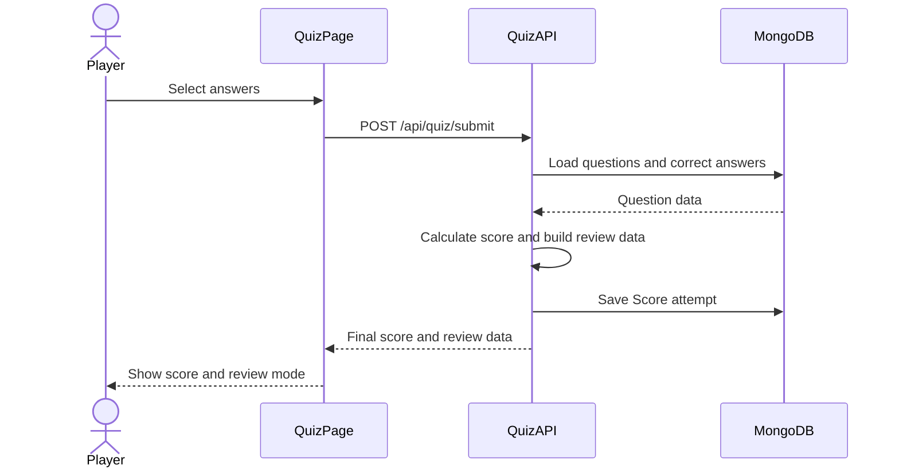

# Feature Package: Quiz Gameplay, Review Mode, Attempts, and Leaderboard

## Owner

TODO: Assign one team member.

## Scope

This feature package owns the complete player quiz flow, from starting a quiz to submitting answers, viewing the final score, reviewing answers, checking past attempts, and viewing the leaderboard.

The owner is responsible for both backend and frontend work for this subsystem.

## Backend Files

```text
backend/controllers/quiz.controller.js
backend/routes/quiz.routes.js
backend/models/Score.js
backend/models/Question.js
```

## Frontend Files

```text
frontend/src/pages/Quiz.jsx
frontend/src/pages/Attempts.jsx
frontend/src/pages/Leaderboard.jsx
frontend/src/context/QuizContext.jsx
frontend/src/api/api.js
```

## API Endpoints To Implement

```text
GET /api/quiz/questions
POST /api/quiz/submit
GET /api/quiz/attempts/me
GET /api/quiz/leaderboard
```

All API responses must use the required envelope format:

```json
{ "success": true, "data": {} }
```

or:

```json
{ "success": false, "error": "Message" }
```

## Task 1: Get Quiz Questions

Implement `GET /api/quiz/questions`.

Requirements:

- Fetch only active questions where `isActive: true`.
- Randomly select 6-10 questions for each quiz attempt.
- Each question must have exactly four answer options.
- Do not send `correctAnswer` to the frontend before submission.
- Return a clear error if there are fewer than 6 active questions.
- Questions must be shuffled randomly for each quiz attempt.

Expected response data example:

```json
{
  "questions": [
    {
      "_id": "questionId",
      "text": "Question text",
      "options": ["A", "B", "C", "D"],
      "variationMeta": {}
    }
  ]
}
```

## Task 2: Quiz Gameplay Page

Implement the player quiz interface in `frontend/src/pages/Quiz.jsx`.

Requirements:

- Load questions from `GET /api/quiz/questions`.
- Display one question at a time.
- Allow the player to select exactly one answer per question.
- Once an answer is submitted or the player moves to the next question, it cannot be changed.
- Use `QuizContext` with `useReducer` to manage quiz state.

Suggested quiz state:

```js
{
  questions: [],
  currentIndex: 0,
  selectedAnswers: {},
  status: "idle" | "ready" | "submitting" | "completed" | "error",
  result: null
}
```

## Task 3: Submit Quiz

Implement `POST /api/quiz/submit`.

Requirements:

- Receive the player's selected answers from the frontend.
- Validate the request body on the backend.
- Load the correct answers from MongoDB.
- Calculate the score on the backend.
- Award +1 point for each correct answer.
- Do not use negative marking, streaks, or bonus points.
- Save the quiz attempt to the `Score` collection.
- Return the final score and review data.

Expected request body example:

```json
{
  "answers": [
    {
      "questionId": "questionId",
      "selectedAnswer": "A"
    }
  ]
}
```

## Task 4: Score Model and Attempt Saving

Every submitted attempt must be saved using the `Score` model.

Required saved data:

```js
{
  userId,
  score,
  answers: [
    {
      questionId,
      selectedAnswer,
      isCorrect
    }
  ],
  createdAt
}
```

Important:

- `userId` must come from the authenticated JWT user.
- The backend must calculate `isCorrect`.
- The frontend must not be trusted to decide correctness.

## Task 5: Review Mode

This project is expected to use the approved variation:

```text
Review mode after completion
```

After quiz submission, the player should see:

- Final score.
- Each question text.
- The player's selected answer.
- The correct answer.
- A correct/incorrect indicator.
- Explanation text if the `Question` model includes an `explanation` field.

Expected submit response data example:

```json
{
  "score": 4,
  "total": 6,
  "review": [
    {
      "questionId": "questionId",
      "text": "Question text",
      "selectedAnswer": "A",
      "correctAnswer": "B",
      "isCorrect": false,
      "explanation": "Optional explanation"
    }
  ]
}
```

Important:

- `correctAnswer` should only be returned after the quiz is submitted.
- `correctAnswer` must not be returned by `GET /api/quiz/questions`.

## Task 6: Attempts History

Implement `GET /api/quiz/attempts/me` and the `/attempts` frontend page.

Requirements:

- Only return attempts for the currently authenticated user.
- Show score and timestamp for each attempt.
- Show the full answer list for each attempt.
- For review mode, include selected answer, correctness, correct answer, and explanation where available.
- Use Mongoose population where appropriate to include question details.

The `/attempts` page should display:

- Attempt date/time.
- Score.
- Question text.
- Selected answer.
- Correct/incorrect status.
- Correct answer.
- Explanation if available.

## Task 7: Leaderboard

Implement `GET /api/quiz/leaderboard` and the `/leaderboard` frontend page.

Requirements:

- Display username and score.
- Sort by score from highest to lowest.
- Ties are allowed.
- Include timestamp if useful.
- Document the leaderboard policy in `README.md`.

Recommended policy:

```text
The leaderboard displays each user's best attempt.
```

This is usually clearer than showing every attempt from every user.

## Acceptance Criteria

This feature package is complete when:

- A logged-in player can start a quiz.
- The backend returns 6-10 random active questions.
- The quiz page displays one question at a time.
- The player can select and submit one answer per question.
- Answers cannot be changed after submission.
- The final quiz submission is scored by the backend.
- The attempt is saved to MongoDB with the full answer list.
- The player sees the final score immediately.
- Review mode displays correct/incorrect details after completion.
- The player can view their own past attempts.
- The leaderboard displays username and score in descending order.
- `correctAnswer` is never exposed before quiz submission.

## Suggested Reflection Material

Primary subsystem:

```text
Quiz gameplay, backend scoring, review mode, attempts history, and leaderboard.
```

Possible technical challenge:

```text
Preventing correct answers from being exposed before quiz submission while still returning complete review data after submission.
```

Possible design decision:

```text
Score calculation is performed only on the backend because the frontend cannot be trusted to determine whether an answer is correct.
```

## Suggested Sequence Diagram



## Suggested Commit Plan

The owner should make several meaningful commits rather than one large commit.

Suggested commits:

1. Implement backend quiz question retrieval.
2. Implement quiz reducer actions and frontend quiz loading.
3. Build one-question-at-a-time quiz UI.
4. Implement backend quiz submission and score calculation.
5. Save quiz attempts to MongoDB.
6. Add review mode response data.
7. Render review mode after completion.
8. Implement attempts history API.
9. Build attempts history page.
10. Implement leaderboard API.
11. Build leaderboard page.
12. Add validation and error handling.
13. Update README/API documentation for this subsystem.

