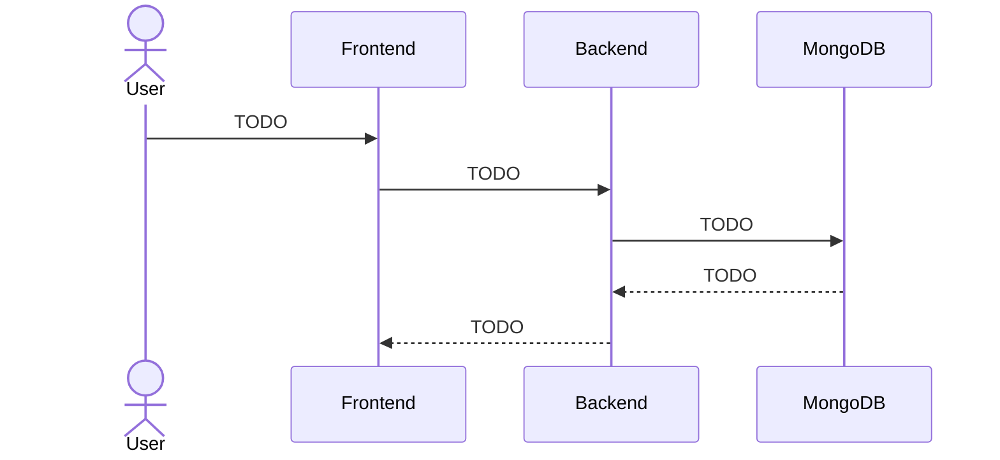

# Individual Contribution Reflection - Student Name

## Primary Subsystem

TODO: Describe the subsystem you owned and how you implemented it.

## Technical Challenge

TODO: Explain one major technical challenge, how you solved it, and link commits/code.

## Subsystem Diagram

## Commit Evidence

| Commit Hash | Summary | Evidence |
| --- | --- | --- |
| TODO | TODO | TODO |

## Variation Design Reflection

TODO: Explain decisions connected to the approved variation.

